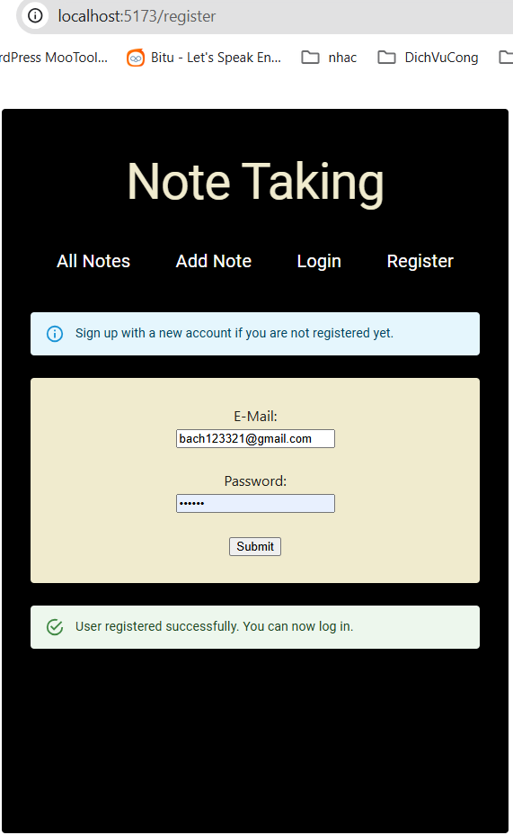
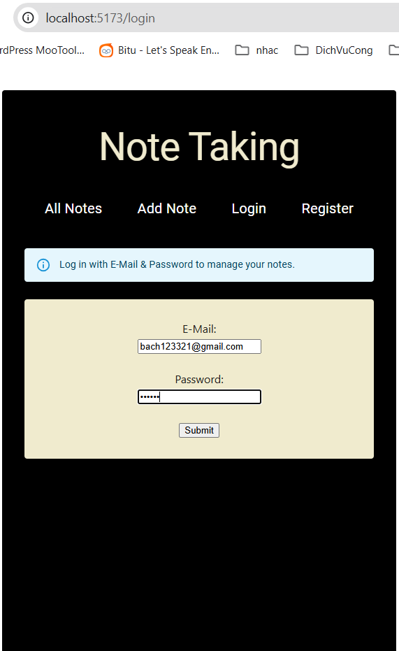
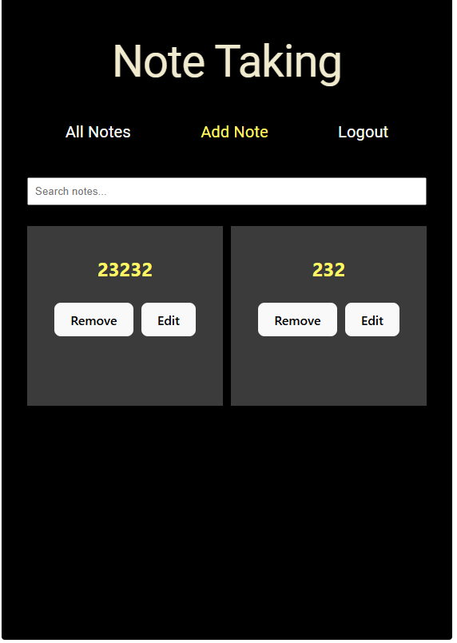
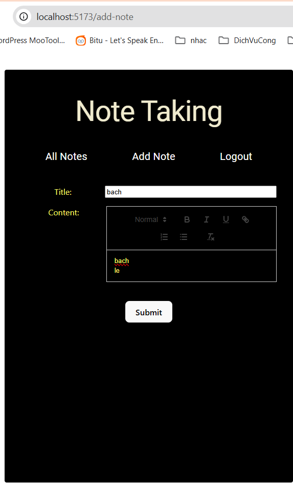
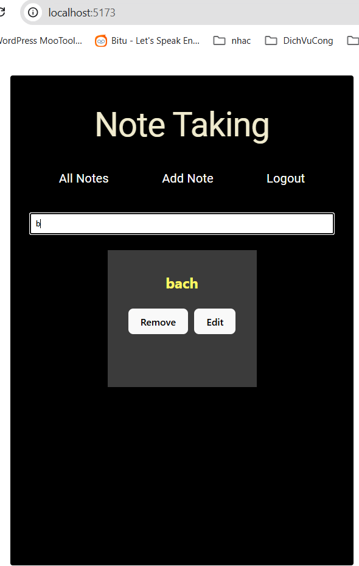

# Note Taking

- Users should be able to create, edit, delete, and search (client-side) notes.
- Notes should support markdown formatting.
- Notes should be persisted in a database.
- UI should follow the provided screen design (feel free to enhance it).
- The application should handle authentication and authorization (login/logout).
- Users should only access their own notes.

## Main technologies used
 - Spring Boot
 - Spring Web MVC, Spring Data JPA, Spring Security
 - Postgres Database
 - React

## Run project

1. Start backend from the backend directory
```ssh
cd backend
mvn spring-boot:run
```

2. Start frontend from the frontend directory
```ssh
cd  cd frontend\simple-notes
npm run dev
```

## Screenshots
### Register

### Login

### successful login

### add note

### filter notes

### edit note
